# Análise Estatística do Corpus — Grafo de Conhecimento de Discurso Científico

**Projeto:** Busca e Mineração de Texto — PESC/COPPE/UFRJ  
**Gerado em:** 18/05/2026 20:13

---

## 1. Corpus (metadados OAI-PMH)

| Métrica | Valor |
|---|---|
| Total de registros no manifest | 3,336 |
| Teses de Doutorado | 897 |
| Dissertações de Mestrado | 2439 |
| Documentos em português | 2881 |
| Documentos em inglês | 434 |
| Comprimento médio do título | 93.291 chars (DP=31.028) |
| Subjects CNPq por documento (mediana) | 4.0 |

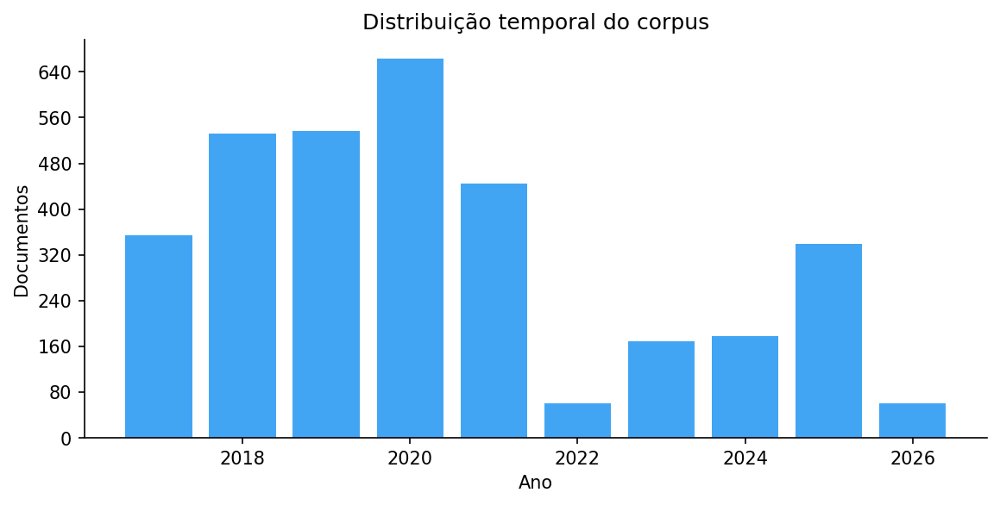
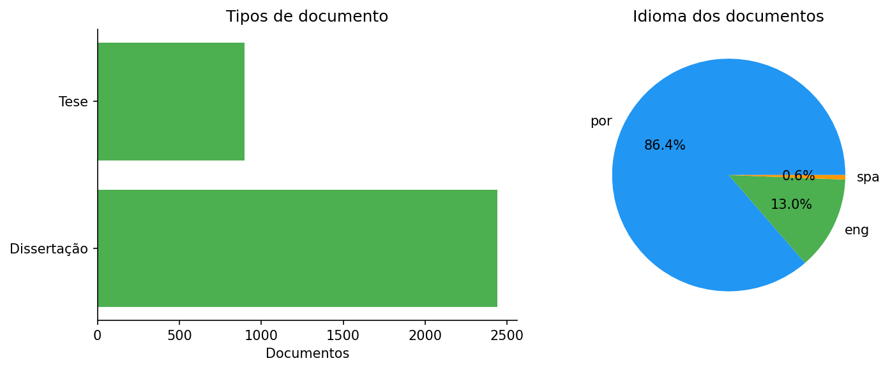

---

## 2. Estrutura do Grafo (DoCO/DEO)

| Métrica | Média | Mediana | DP | P95 |
|---|---|---|---|---|
| Seções DoCO por documento | 40.391 | 35.0 | 31.463 | 96.0 |
| Parágrafos por documento | 175.239 | 147.5 | 130.536 | 416.0 |
| Referências por documento | 73.155 | 57.0 | 63.619 | 183.0 |

### Cobertura dos tipos retóricos DEO

| Tipo DEO | Documentos | % do corpus |
|---|---|---|
| `deo:Results` | 1,414 | 61.1% |
| `deo:Conclusion` | 1,306 | 56.4% |
| `deo:Introduction` | 1,192 | 51.5% |
| `deo:Methods` | 1,095 | 47.3% |
| `deo:Discussion` | 1,036 | 44.7% |
| `deo:RelatedWork` | 802 | 34.6% |
| `deo:Background` | 407 | 17.6% |
| `deo:FutureWork` | 220 | 9.5% |
| `deo:Acknowledgements` | 153 | 6.6% |

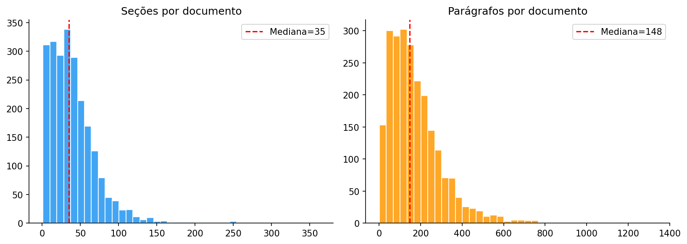
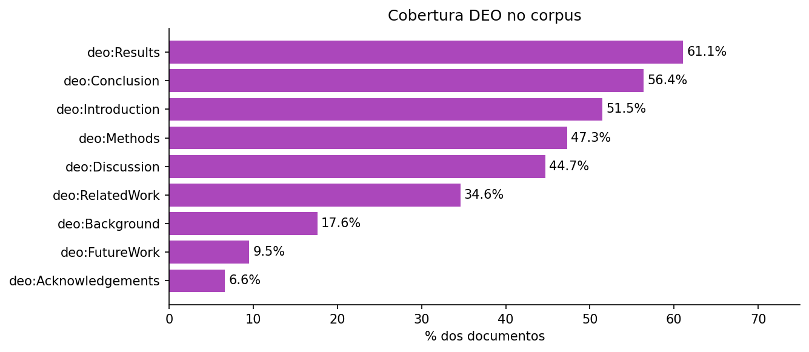
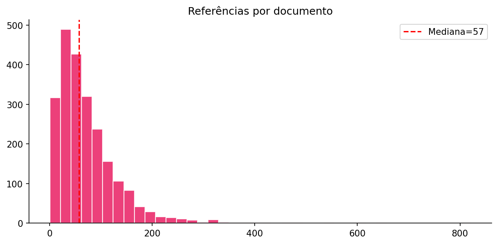

---

## 3. Discurso Científico (extração LLM)

| Elemento | Média/doc | Mediana | DP | P95 |
|---|---|---|---|---|
| Claims | 10.323 | 8.0 | 9.071 | 29.0 |
| Limitações | 1.727 | 1.0 | 2.365 | 6.0 |
| Trabalhos futuros | 3.468 | 3.0 | 3.403 | 10.0 |

### Concentração da extração

**Coeficiente de Gini (claims):** `0.4186`

> O coeficiente de Gini mede concentração: 0 = distribuição uniforme, 1 = máxima concentração.
> Valor `0.4186` indica concentração moderada — distribuição heterogênea mas não extrema.

### Correlação tamanho de seção × claims extraídos

**Spearman ρ = `0.582`** — correlação positiva significativa: seções maiores produzem sistematicamente mais claims.

### Distribuição de keywords — Lei de Zipf

**Expoente α = `0.34` (R² = `0.765`)**

> A lei de Zipf clássica (vocabulário de língua natural) tem α ≈ 1. Expoente menor
> indica cauda mais longa — termos técnicos distribuem-se de forma menos concentrada
> que vocabulário geral, o que é esperado em um corpus científico especializado.

### Top 10 keywords inferidas pelo LLM

| # | Keyword | Frequência |
|---|---|---|
| 1 | método dos elementos finitos | 334 |
| 2 | análise tga | 84 |
| 3 | rede lstm | 83 |
| 4 | rede neural | 37 |
| 5 | modelagem | 28 |
| 6 | otimização | 26 |
| 7 | modelagem matemática | 25 |
| 8 | wisard | 23 |
| 9 | catalisador | 22 |
| 10 | modelo matemático | 22 |

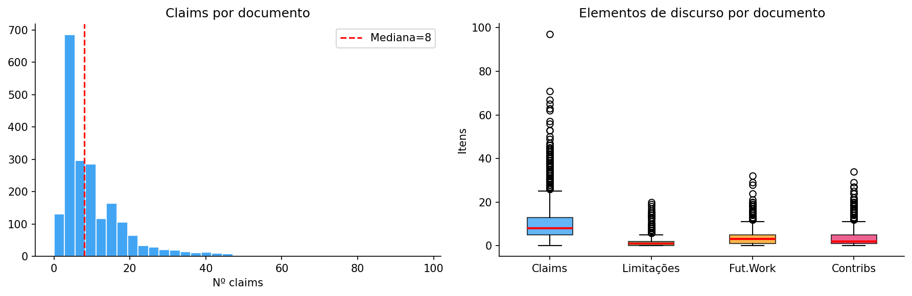
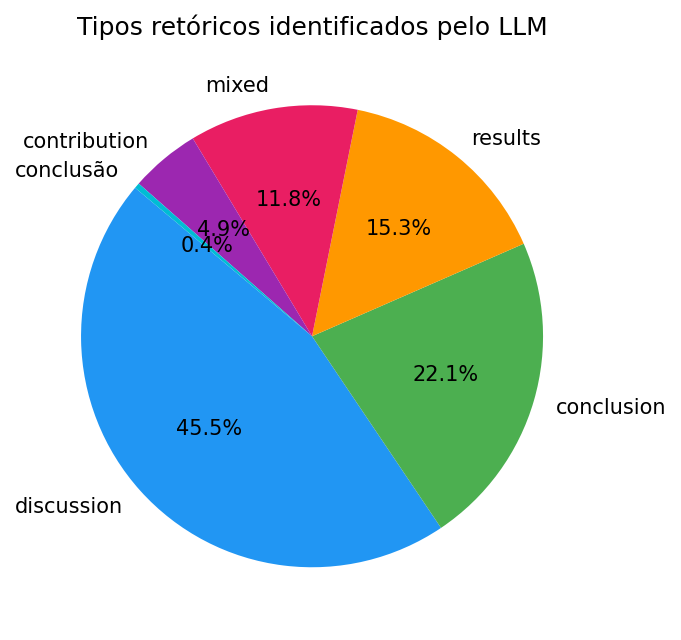
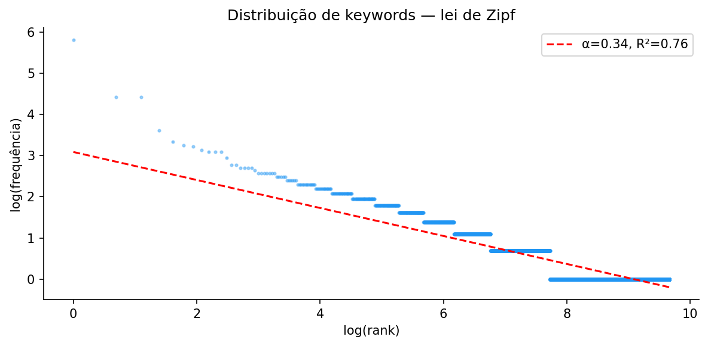
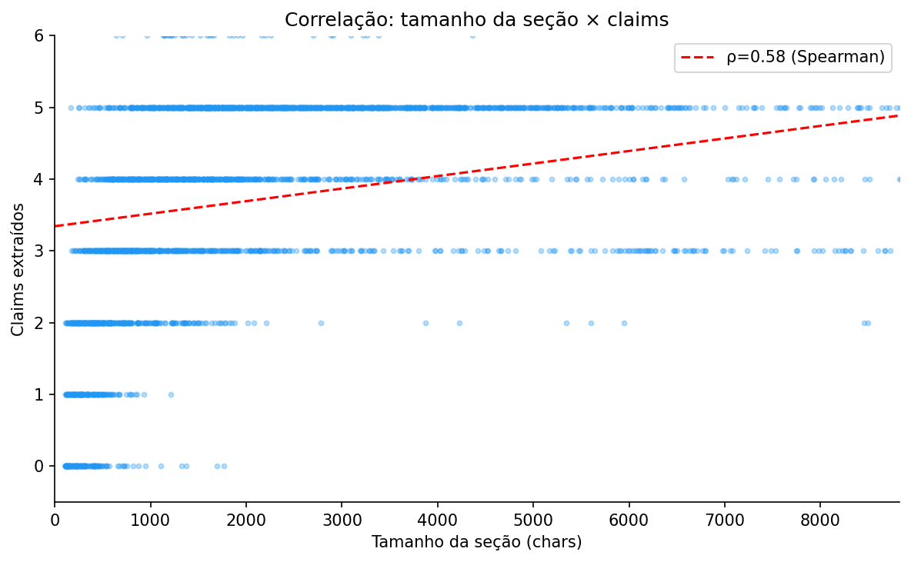

---

## 4. Análise por Área CNPq

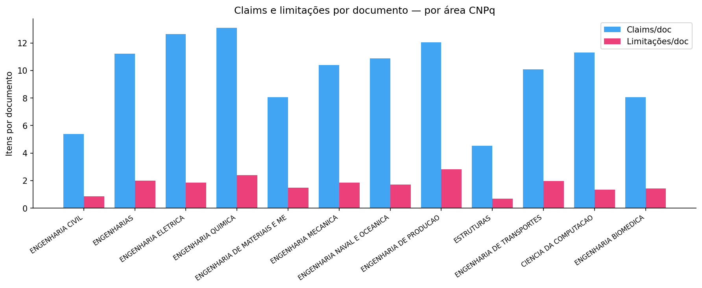

---

## 5. Evolução Temporal

| Ano | Documentos | Claims/doc | Limitações/doc |
|---|---|---|---|
| 2017 | 232 | 2.84 | 0.38 |
| 2018 | 318 | 3.19 | 0.46 |
| 2019 | 417 | 10.81 | 1.7 |
| 2020 | 514 | 10.72 | 1.95 |
| 2021 | 297 | 10.53 | 1.74 |
| 2022 | 30 | 4.5 | 0.8 |
| 2023 | 101 | 9.92 | 1.66 |
| 2024 | 91 | 12.26 | 2.1 |
| 2025 | 263 | 12.33 | 2.13 |

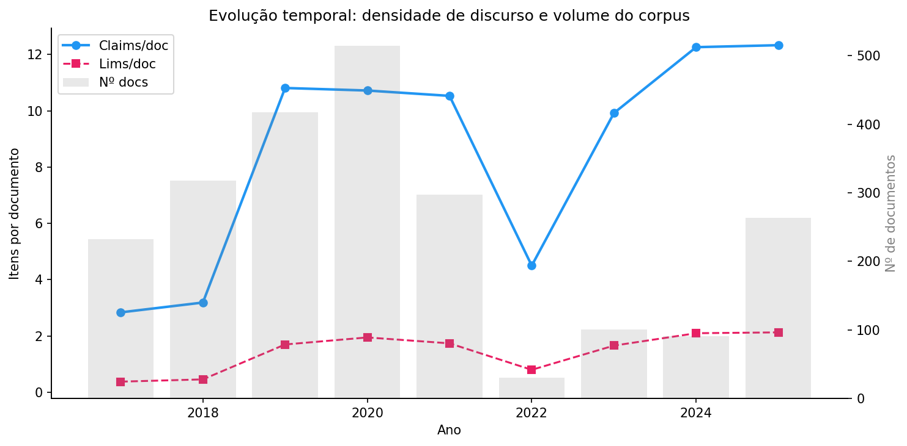

---

## 6. Análise de Rede do Grafo RDF

A análise de rede examina o grafo RDF como uma estrutura de dados relacional,
revelando a topologia das conexões entre documentos, seções, parágrafos e elementos de discurso.

| Métrica | Valor |
|---|---|
| Nós no subgrafo analisado | 49,519 |
| Arestas (relações) | 6,621 |
| Componentes conectados | 42898 |
| Maior componente | 0.0% dos nós |
| In-degree médio | 0.134 |
| In-degree máximo | 1.0 |
| Out-degree médio | 0.134 |

### Distribuição de tipos de nós

| Tipo | Nós |
|---|---|
| Parágrafo | 31,483 |
| Outro | 11,860 |
| Seção | 6,027 |
| Referências | 149 |

A distribuição de grau em escala logarítmica (gráfico abaixo) revela se o grafo
segue uma lei de potência (comum em grafos de conhecimento reais), onde poucos nós
concentram a maior parte das conexões.

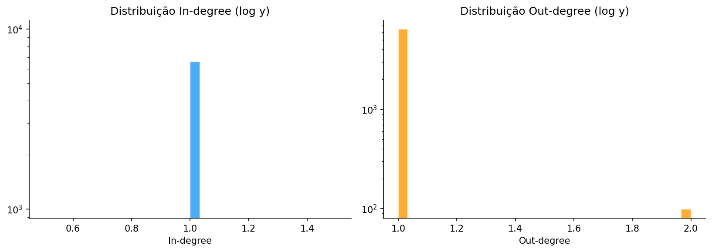
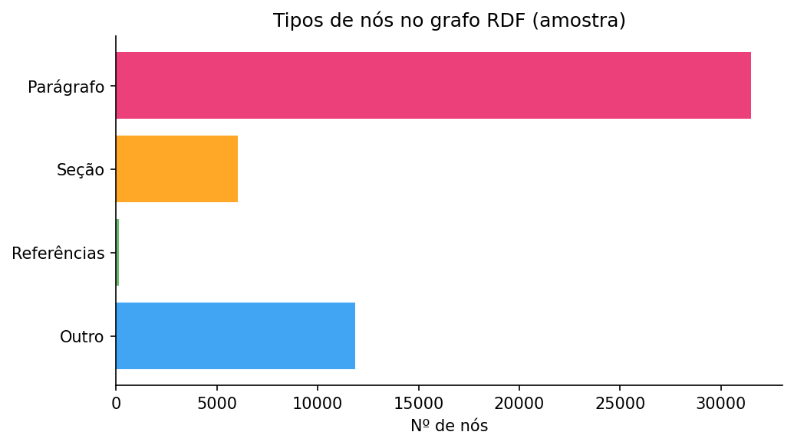

---

## 7. Estrutura Bruta dos Documentos (TEI)

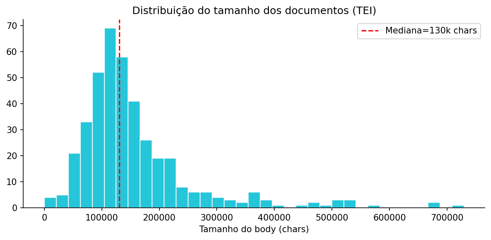

---

*Relatório gerado automaticamente por `corpus_statistics.py` — 18/05/2026 20:13*
